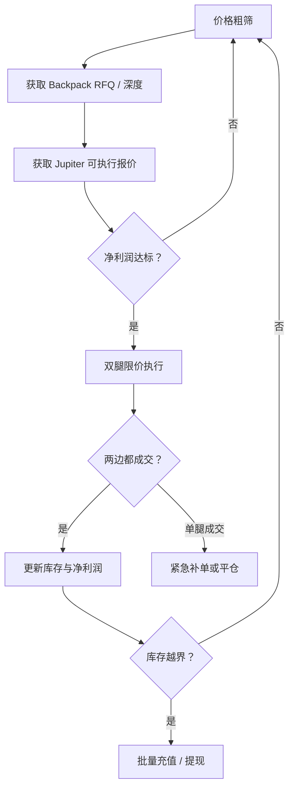

现在 backpack 交易所支持美股交易，链上jup.ag也支持美股交易，想通过监控两边的价差实现套利，方案设计如下：

> 两边预先放好股票/股票代币和 USDC，同时成交，之后批量再平衡库存。

## 一、先区分哪些价差是真套利

Jupiter 支持多个发行方的美股代币，包括 xStocks、Remora、Backpack Securities 等。[Jupiter 官方说明](https://docs.jup.ag/user-docs/trade/swap/tokens-and-trading)

只有同时满足以下条件才能纳入：

1. Jupiter 上是“Backpack Securities”发行的代币。
2. Backpack 支持该代币充入和提走。
3. 充入后能 1:1 转成 Backpack 证券权益。
4. Mint 地址与官方公布地址完全一致。

例如：

* MU 官方 Mint：`MUxEsUKSMACyw5fZf68wxf5FLnZVhtU9CwH8uNNGay1`
* SKHY 官方 Mint：`SKHYhSjuRWHgikq8eRKbtBbpABgJSkd7ytQV14i9EQ3`
* DRAM 官方 Mint：`DRAMjSWR7HRfJKjRkvQWYL2bcaejaVhuxEcjf4pAY4Cw`

MU 和 SKHY 都明确支持代币与 Backpack 证券权益双向转换。[MU 说明](https://learn.backpack.exchange/blog/tokenized-micron-mu)、[SKHY 说明](https://learn.backpack.exchange/blog/sk-hynix-skhy-backpack)

不要把 Jupiter 上的 AAPLx 与 Backpack 的 AAPL.US 直接当成可交割套利。如果发行方不同，即使跟踪同一只股票，也只是“跨发行方基差交易”。

## 二、套利的两条路径

| 方向          | 同时执行                     | 后续库存变化               | 再平衡方式                 |
| ----------- | ------------------------ | -------------------- | --------------------- |
| Jupiter 便宜  | Jupiter 买代币；Backpack 卖股票 | 链上股票增加，Backpack 股票减少 | 把链上代币充入 Backpack      |
| Backpack 便宜 | Backpack 买股票；Jupiter 卖代币 | Backpack 股票增加，链上股票减少 | 从 Backpack 提币到 Solana |

每个标的建议预先配置四个资金桶：

* Backpack：50% USDC + 50% 股票权益
* Solana：50% USDC + 50% 对应股票代币

更具体地说，假设给 MU 分配 10,000 USDC：

* Backpack 股票：约 2,500 美元
* Backpack USDC：约 2,500 美元
* Solana MU 代币：约 2,500 美元
* Solana USDC：约 2,500 美元

这样两个方向都能立刻成交，不需要做裸空或等待跨平台转账。

## 三、报价必须使用“真实可成交价”

不能用页面显示价、最后成交价或者传统美股中间价计算。

### Backpack 侧

交易时段内，股票主要通过 RFQ 报价：

1. `POST /api/v1/rfq`
2. 使用 `executionMode=AwaitAccept`
3. 从 `account.rfqUpdate` 获取 `rfqCandidate`
4. 满足条件后调用 `/api/v1/rfq/accept`

Backpack 的股票 RFQ 接受后具有约束力，之后由经纪商完成延迟结算。[Backpack API 文档](https://docs.backpack.exchange/)

非美股交易时段，部分代币化股票使用现货订单簿，这时订阅：

* `bookTicker.<symbol>`
* `depth.<symbol>`
* REST `/api/v1/depth`

计算指定数量的订单簿 VWAP，而不是只看第一档价格。

### Jupiter 侧

采用两层报价：

* 粗筛：Price API V3，一次最多查询50个 Mint。
* 精算：`GET /swap/v2/order`，按真实下单数量取得完整路由和交易。[Price API](https://dev.jup.ag/docs/price)、[Swap V2](https://dev.jup.ag/docs/swap)

Jupiter 页面价格只能用于展示。最终套利计算必须使用：

* 买入：最大可能支付的 USDC
* 卖出：最小保证收到的 USDC
* 包含 AMM 费、Jupiter 费、价格冲击和滑点保护

## 四、价差计算

对于数量 (q)：

### Jupiter 买、Backpack 卖

[
Profit_{J\to B}
= q\times B_{bid}

* J_{buy,max}
* Cost_{rebalance}
* Cost_{failure}
  ]

### Backpack 买、Jupiter 卖

[
Profit_{B\to J}
= J_{sell,min}

* q\times B_{ask}
* Cost_{rebalance}
* Cost_{failure}
  ]

其中：

* (B_{bid})：Backpack RFQ 实际卖出价
* (B_{ask})：Backpack RFQ 实际买入价
* (J_{buy,max})：考虑滑点后的 Jupiter 最大支付额
* (J_{sell,min})：考虑滑点后的 Jupiter 最低到账额
* `Cost_rebalance`：充值、提现、链上手续费的摊销
* `Cost_failure`：单腿成交风险缓冲

Backpack 当前披露，股票提现到 Solana 的平台费用大约是 0.50 美元，并以股票代币扣除；应以实时资产配置为准。[转换流程](https://support.backpack.exchange/backpack-securities/tokenized-securities/conversion-flow)

## 五、建议触发阈值

MVP 阶段不要一开始抢10～20bp的小价差。

建议：

| 条件           |         初始设置 |
| ------------ | -----------: |
| 粗筛价差         |      ≥ 0.30% |
| 自动成交净价差      |      ≥ 0.60% |
| 单笔最低预计利润     |     ≥ 5 USDC |
| Jupiter 价格冲击 |      ≤ 0.30% |
| 单笔规模         | 不超过链上有效深度的5% |
| 报价最大年龄       |    500–800ms |
| 单标的库存使用      |  不超过可用库存的20% |

运行稳定后，再把自动阈值逐渐压到 0.25%～0.40%。

库存方向也应影响阈值：

* 能恢复库存平衡的交易：降低阈值。
* 继续消耗稀缺库存的交易：提高阈值。
* 任意一边库存低于30%：停止该方向。
* 达到30/70边界：批量充值或提现。

这样可以把多次套利相互抵消，减少真正需要跨平台搬运的次数。

## 六、执行状态机

推荐流程：

因为无法跨 CEX 和 Solana 原子成交，所以一定要有：

* `BOTH_FILLED`
* `JUP_ONLY_FILLED`
* `BACKPACK_ONLY_FILLED`
* `COMPENSATING`
* `MANUAL_INTERVENTION`

这些状态。

正常情况下可接近同时提交两腿。考虑到 Jupiter 通常是更容易滑点或失败的一腿，可以把它作为主执行腿；但不要等完全确认后才执行 Backpack，否则 RFQ 很可能已经变化。

单腿失败后：

1. 立即重新询价。
2. 在预设最大亏损范围内完成另一腿。
3. 超过最大亏损阈值则停止该标的并报警。
4. 禁止无限追价。

## 七、系统模块

建议用 TypeScript/Node.js 实现：

* `asset-registry`：标的、官方 Mint、精度、充提状态、最小数量。
* `backpack-feed`：ticker、depth、RFQ、账户余额和成交。
* `jupiter-quote`：Price V3 粗筛、Swap V2 双向精确报价。
* `opportunity-engine`：计算不同数量下的净利润。
* `executor`：Backpack 签名请求、Solana 交易签名与发送。
* `inventory-manager`：四资金桶、库存偏移、再平衡。
* `risk-engine`：单腿失败、行情停牌、报价过期、RPC异常。
* `recorder`：保存每次报价、路由、延迟、预期和实际利润。
* `alert`：Telegram 推送机会、成交、失败和库存不足。

Backpack API 使用 ED25519 请求签名；Jupiter API 使用 API Key，交易由独立 Solana 热钱包签名。提现权限和交易权限最好使用不同密钥。

## 八、最合适的上线顺序

1. 先只做 MU、SKHY 等官方 Mint 已确认的标的。
2. 连续记录3～7天双向可成交价，不下单。
3. 统计价差分布、持续时间、Jupiter 实际深度及两边延迟。
4. 开启提醒，不自动交易。
5. 使用100～300 USDC小额实盘。
6. 验证一次完整的 Backpack→Solana 和 Solana→Backpack 转换。
7. 最后启用自动成交和批量再平衡。

这个项目真正的难点是“可成交价 + 双腿失败处理 + 库存管理”，数据采集本身并不复杂。最值得先做的是一个只读扫描器，输出每个标的在 1股、2股、5股三个规模下的双向净价差；有了几天真实数据后，才能判断这里究竟有持续利润，还是只有页面显示上的假价差。

截至 2026 年 7 月 29 日，Backpack 官方公告中确认到 **9 个由 Backpack Securities 发行、可在 Solana/Jupiter 交易的官方 Mint 标的**：

| 标的   | 对应证券                 | 官方 Solana Mint                                 |
| ---- | -------------------- | ---------------------------------------------- |
| SPCX | SpaceX               | `SPCXxcqXj6e5dJDVNovHN8744zkbhM2bYudU45BimGb`  |
| MU   | Micron               | `MUxEsUKSMACyw5fZf68wxf5FLnZVhtU9CwH8uNNGay1`  |
| SNDK | Sandisk              | `SNDKbwMUQvZhnLnxLduradgLHG5KrPuKwpnrkkGRhfH`  |
| DRAM | Roundhill Memory ETF | `DRAMjSWR7HRfJKjRkvQWYL2bcaejaVhuxEcjf4pAY4Cw` |
| BOT  | RoboStrategy         | `BoTx8y9ynfdxf5ZjWtCoBVkff52qKA82ysaLU8ZM6d8T` |
| SKHY | SK hynix ADR         | `SKHYhSjuRWHgikq8eRKbtBbpABgJSkd7ytQV14i9EQ3`  |
| HOOD | Robinhood            | `HooDYv5RewLRiMLnEVq3VJqdqxhuE6c5eYvqejMC3e9A` |
| INTC | Intel                | `iNTCy1qTsUEZQe3DSocLz1ZXXai34Gdw8THQh5rxFaF`  |
| MSTR | Strategy             | `MSTRdWXMeZxdE8osAQy3fA4rvTY5rgummDSMEx6U7Nz`  |

这些 Token 的共同特征是：

* 发行方显示为 `Backpack Securities`
* 可通过 Backpack 按 **1:1** 转换成对应证券权益
* 可在 Solana 自托管并通过 Jupiter 等渠道交易
* 不是 Jupiter 上同名的 xStocks、Remora 或其他发行方代币

官方依据：[SPCX](https://x.com/Backpack/status/2065631177193754626)、[MU](https://learn.backpack.exchange/blog/tokenized-micron-mu)、[SNDK](https://learn.backpack.exchange/blog/tokenized-sandisk-sndk)、[DRAM](https://learn.backpack.exchange/blog/tokenized-roundhill-memory-etf-dram)、[BOT](https://learn.backpack.exchange/blog/tokenized-robostrategy-bot)、[SKHY](https://learn.backpack.exchange/blog/sk-hynix-skhy-backpack)、[HOOD](https://learn.backpack.exchange/blog/tokenized-robinhood-hood)、[INTC](https://learn.backpack.exchange/blog/tokenized-intel-intc)、[MSTR](https://learn.backpack.exchange/blog/tokenized-strategy-mstr)。

对于套利程序，先把这 9 个全部放入 `asset-registry` 白名单，但每次运行前再动态检查：

1. Backpack 当前是否支持该标的交易；
2. 充值和提现是否开放；
3. Jupiter 是否存在有效路由；
4. Mint 是否与上表完全一致；
5. 实际流动性是否足以覆盖交易量。

第一批优先监控可以选：**MU、SKHY、SNDK、INTC、MSTR**。它们和传统市场的价格锚定更直接，更适合验证 Backpack ↔ Jupiter 的可交割套利。
